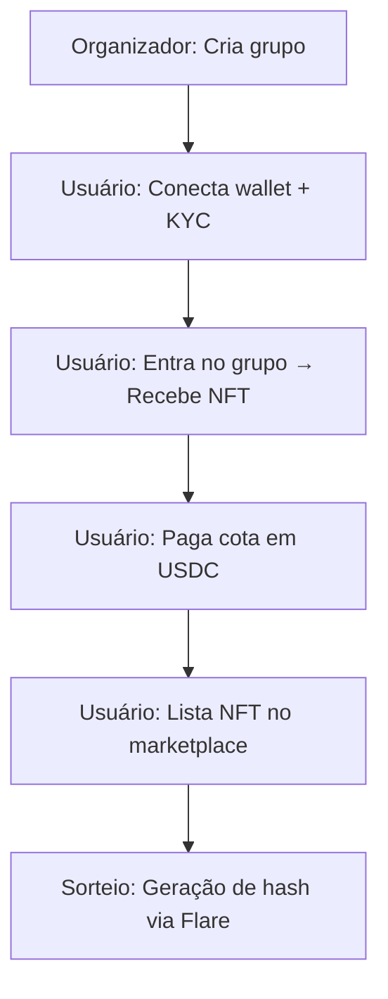
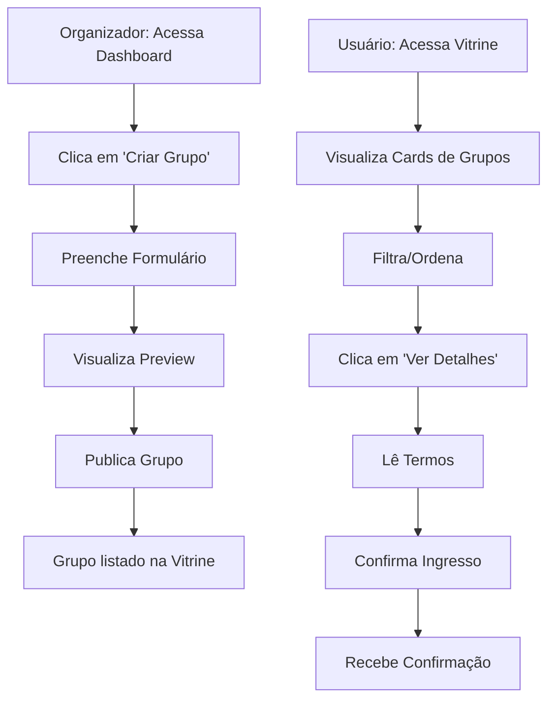
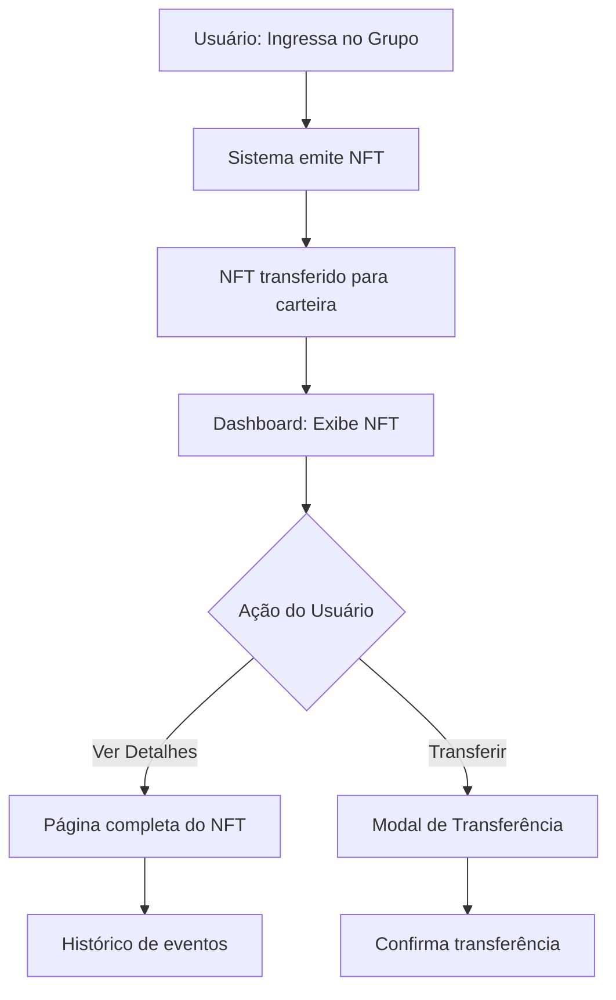
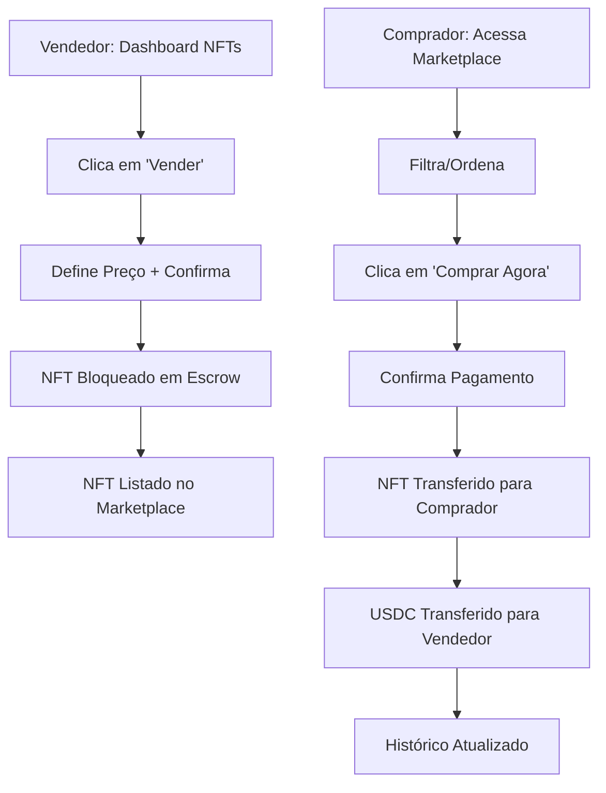
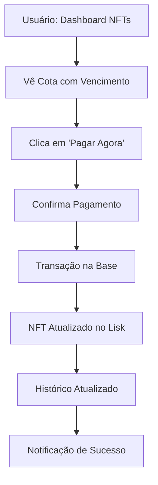
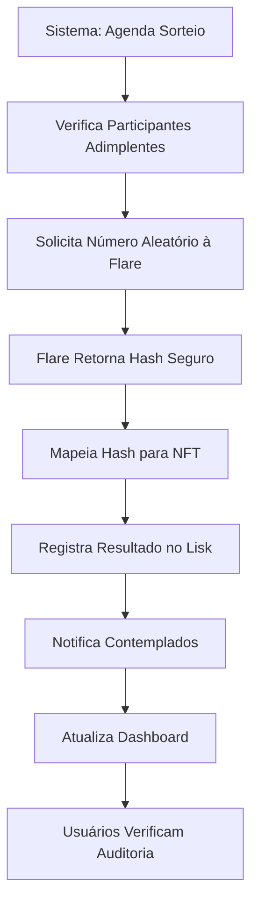
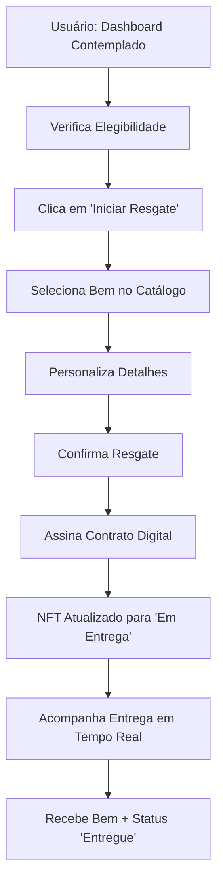
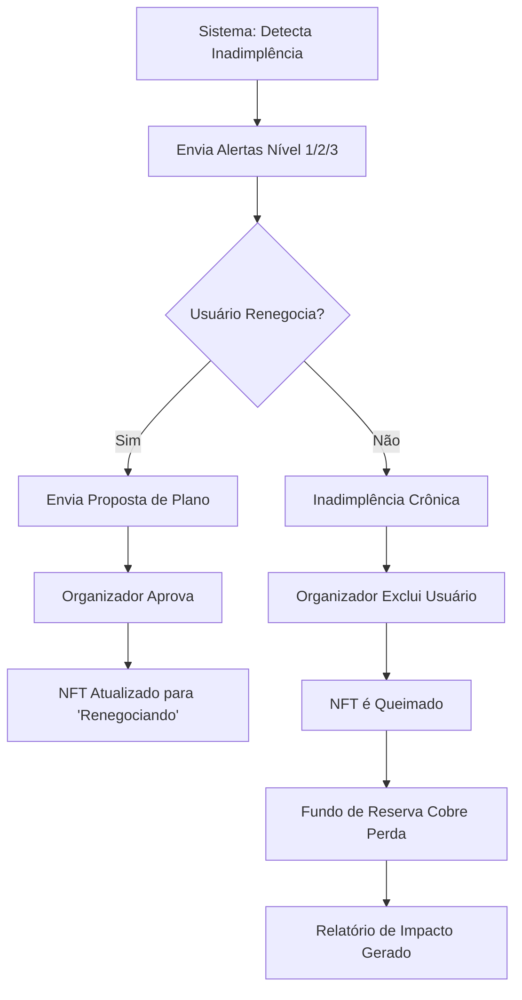

Link para a conversa - https://chat.z.ai/s/f45e71a7-708d-4b99-acf8-335130bab903 

### **One-Pager Unificado: Plataforma de Consórcios Imobiliários Tokenizados**  
**Data:** 30/08/2025 | **Hackathon:** Aleph Hackathon (Tracks: Lisk, Flare, Filecoin, Base)  

---

### **1. Visão do Produto**  
**Problema:**  
Jovens argentinos (25-35 anos) enfrentam barreiras para aquisição imobiliária:  
- 38% vivem com os pais por falta de acesso ao crédito.  
- "Planes de ahorro" tradicionais têm custos ocultos e parcelas inflacionadas.  

**Solução:**  
Plataforma de consórcios imobiliários tokenizados em blockchain, onde:  
- **Cartas de consórcio são NFTs** (transparência + negociação secundária).  
- **Pagamentos em stablecoins** (proteção contra inflação).  
- **Sorteios auditáveis via Flare** (imparcialidade comprovada).  

---

### **2. Público-Alvo**  
| **Persona**       | **Perfil**                                  | **Necessidade**                                  |  
|-------------------|---------------------------------------------|------------------------------------------------|  
| **Participante**  | Jovens 25-35 anos, inquilinos, autônomos.    | Comprar imóvel sem entrada (0% vs. 20-30% tradicional). |  
| **Investidor**    | Traders de NFTs, investidores secundários.   | Negociar cartas contempladas para liquidez.    |  
| **Organizador**   | Simulado no MVP (futuro: empresas IGJ).      | Gerenciar grupos com transparência.            |  

---

### **3. MVP: Escopo e Fluxo**  
#### **Funcionalidades Essenciais**  
| **Função**               | **Descrição**                                                                 | **Tecnologia**                          |  
|--------------------------|-----------------------------------------------------------------------------|------------------------------------------|  
| **Onboarding**           | Conexão de wallet (MetaMask) + KYC leve (ID + selfie).                       | KYC-Chain / BrightID                    |  
| **Grupos Disponíveis**   | Vitrine com dados: participantes, valor da cota, datas de sorteios.          | Dashboard (Figma)                       |  
| **Pagamento de Cotas**   | On-chain em stablecoins (USDC).                                             | Base (L2)                               |  
| **NFTs como Cartas**     | Tokenização das cotas (ERC-721) para rastreio e negociação.                 | Lisk (baixo custo)                      |  
| **Marketplace**          | Vitrine simples para listar/comprar NFTs (preço definido pelo usuário).      | Smart Contract (Lisk)                   |  
| **Sorteio Auditável**    | Hash da transação + uso de Flare Secure Random Numbers.                      | [Flare API](https://dev.flare.network/) |  
| **Dashboard do Usuário** | Acompanhamento: NFTs, pagamentos, status do grupo, hash do sorteio.          | React + Web3.js                         |  

#### **Fluxo do Usuário**  

---

### **4. Tecnologias Prioritárias**  
| **Track**       | **Aplicação**                                  | **Benefício**                                  |  
|-----------------|-----------------------------------------------|-----------------------------------------------|  
| **Lisk**        | Tokenização de cartas (NFTs).                  | Baixo custo + interoperabilidade.             |  
| **Flare**       | Sorteios imparciais (Secure Random Numbers).   | Auditoria pública + confiança.                |  
| **Base**        | Pagamentos em stablecoins (USDC).              | Microtransações rápidas e baratas.            |  
| **Filecoin**    | Armazenamento de documentos (KYC, contratos). | Privacidade + conformidade (opcional MVP).    |  

---

### **5. O que Fica Fora do MVP**  
| **Funcionalidade**               | **Motivo**                                  | **Quando Implementar?**       |  
|----------------------------------|---------------------------------------------|-------------------------------|  
| Correção inflacionária           | Complexidade técnica + dados macroeconômicos. | Pós-MVP (índices oficiais).  |  
| Simulador de lances              | Algoritmo dependente de histórico do grupo.  | Pós-validação.               |  
| Gestão avançada de taxas         | Organizadores definirão taxas fixas (2-10%). | Futuro (painel admin).       |  
| Notificações em tempo real       | Requer backend complexo.                     | Versão 2.0.                  |  
| Chat de suporte                  | Ferramenta externa resolve no curto prazo.    | Integração futura.           |  

---

### **6. Métricas de Sucesso**  
| **Métrica**                     | **Meta**      | **Por quê?**                                  |  
|---------------------------------|---------------|-----------------------------------------------|  
| Usuários com wallet conectada   | 50+           | Valida adesão ao modelo.                      |  
| Grupos ativos                   | 5 simulados   | Demonstra viabilidade do ecossistema.         |  
| Transações em stablecoins       | 20+           | Confere usabilidade do pagamento.             |  
| NFTs listados no marketplace    | 10+           | Mede demanda por liquidez.                    |  
| Sorteios com hash público       | 100%          | Garante transparência.                        |  

---

### **7. Riscos e Mitigação**  
| **Risco**                       | **Mitigação**                              |  
|---------------------------------|--------------------------------------------|  
| KYC leve insuficiente           | Usar KYC-Chain (API rápida para hackathon). |  
| Volatilidade de stablecoins     | Usar USDC + alertas no dashboard.           |  
| Baixa adoção do marketplace     | Focar em grupos com NFTs "desejáveis" (ex: imóveis em Buenos Aires). |  
| Complexidade técnica            | Simular integrações com APIs (Postman).    |  

---

> **Nota:** Este documento é a base para os PRDs. Decisões técnicas serão validadas durante o hackathon.  

—

### **PRD 0: Contexto e Configuração Inicial**  
**Versão:** 1.0 | **Data:** 30/08/2025  
**Objetivo:** Estabelecer o contexto do produto e definir as funcionalidades iniciais para onboarding de usuários, conexão de carteira e KYC leve. Este é o PRD fundamental, pois sem usuários autenticados e validados, as demais funcionalidades não são viáveis.

---

### **1. Contexto do Produto**  
**Visão Geral:**  
Plataforma de consórcios imobiliários tokenizados para jovens argentinos (25-35 anos) e investidores secundários. Cada "carta" é um NFT, garantindo transparência, rastreabilidade e negociação secundária.  

**Público-Alvo:**  
- **Persona 1 (Participante):** Jovens adultos, inquilinos de média renda, profissionais autônomos.  
- **Persona 2 (Investidor):** Traders de NFTs no marketplace secundário.  
- **Organizador:** Simulado no MVP (futuro: empresas reguladas pela IGJ).  

**Tecnologias-Chave:**  
- Blockchain: **Lisk** (tokenização de NFTs), **Base** (pagamentos em stablecoins).  
- Segurança: **Flare Secure Random Numbers** (sorteios auditáveis).  
- Compliance: **KYC leve** (ID + selfie via KYC-Chain/BrightID).  

---

### **2. Funcionalidades do PRD 0**  
#### **2.1. Conexão de Carteira (Wallet Connection)**  
**Objetivo:** Permitir que usuários conectem suas carteiras cripto (ex: MetaMask) para autenticação e transações.  

**User Stories:**  
- Como **usuário**, quero conectar minha carteira MetaMask para acessar a plataforma.  
- Como **usuário**, quero ver meu endereço de carteira e saldo de stablecoins (USDC) no dashboard.  

**Acceptance Criteria:**  
- [ ] Botão "Conectar Carteira" visível na tela inicial.  
- [ ] Suporte para MetaMask e outras carteiras compatíveis (ex: WalletConnect).  
- [ ] Após conexão, exibir endereço da carteira (formato abreviado: `0x123...abc`).  
- [ ] Exibir saldo de USDC disponível (integrado à API da Base).  

**Telas/Componentes:**  
- **Tela de Login:** Botão "Conectar Carteira", ícone da MetaMask.  
- **Dashboard:** Cabeçalho com endereço da carteira e saldo de USDC.  

**Technical Considerations:**  
- Biblioteca: `web3.js` ou `ethers.js` para integração com carteiras.  
- Rede: Configurar para rede **Base** (testnet no MVP).  

---

#### **2.2. Cadastro com KYC Leve**  
**Objetivo:** Validar a identidade do usuário para compliance, sem burocracia excessiva.  

**User Stories:**  
- Como **usuário**, quero fazer upload de meu documento de identidade e uma selfie para comprovar minha identidade.  
- Como **usuário**, quero receber confirmação de aprovação do KYC em até 5 minutos.  

**Acceptance Criteria:**  
- [ ] Formulário com campos: nome completo, e-mail, upload de ID (PDF/IMG) e selfie (câmera ou upload).  
- [ ] Integração com API de KYC (ex: KYC-Chain ou BrightID) para validação automática.  
- [ ] Status do KYC exibido no dashboard: "Pendente", "Aprovado" ou "Rejeitado".  
- [ ] Usuários com KYC rejeitado podem tentar novamente.  

**Telas/Componentes:**  
- **Tela de KYC:** Formulário de cadastro, botões de upload para ID e selfie.  
- **Dashboard:** Badge de status do KYC (ex: ✅ Aprovado).  

**Technical Considerations:**  
- API de KYC: Usar sandbox do [KYC-Chain](https://kyc-chain.com/) para testes.  
- Armazenamento: Dados sensíveis criptografados (ex: via **Filecoin**).  

---

#### **2.3. Dashboard Inicial do Usuário**  
**Objetivo:** Centralizar informações essenciais após o login (status do KYC, carteira, ações rápidas).  

**User Stories:**  
- Como **usuário**, quero ver meu status de KYC e saldo de USDC assim que entro na plataforma.  
- Como **usuário**, quero acessar rapidamente as ações: "Ver Grupos", "Meus NFTs", "Marketplace".  

**Acceptance Criteria:**  
- [ ] Exibir:  
  - Status do KYC (badge colorido).  
  - Endereço da carteira e saldo de USDC.  
  - Cards de navegação: "Ver Grupos", "Meus NFTs", "Marketplace".  
- [ ] Responsividade: Layout adaptável para mobile e desktop.  

**Telas/Componentes:**  
- **Dashboard:**  
  - Cabeçalho: Logo, endereço da carteira, saldo USDC.  
  - Corpo: Status do KYC, cards de ações rápidas.  
  - Rodapé: Links para suporte e termos de uso.  

**Technical Considerations:**  
- Framework: React + Web3.js para integração com blockchain.  
- Design: Componentes reutilizáveis (ex: Card, Badge).  

---

### **3. Fluxo do Usuário (PRD 0)**  
```mermaid
graph TD
  A[Tela Inicial] --> B[Botão "Conectar Carteira"]
  B --> C[Conexão com MetaMask]
  C --> D[Dashboard Inicial]
  D --> E{KYC Aprovado?}
  E -->|Sim| F[Exibir ações: Ver Grupos, Meus NFTs, Marketplace]
  E -->|Não| G[Tela de KYC]
  G --> H[Upload ID + Selfie]
  H --> I[Validação via API]
  I --> F
```
---

### **4. Critérios de Sucesso**  
- **Métricas:**  
  - Taxa de conexão de carteiras: >70% dos visitantes.  
  - Tempo médio para KYC aprovado: <5 minutos.  
  - Taxa de conversão (visitante → usuário com KYC): >40%.  
- **Testes:**  
  - Usuários conseguem conectar MetaMask em <1 minuto.  
  - KYC rejeitado em <10% dos casos (falsos positivos).  

---

### **5. Próximos Passos**  
- **PRD 1: Group Management**  
  - Criação de grupos por organizadores.  
  - Vitrine de grupos disponíveis (dados: participantes, valor da cota, datas de sorteios).  
- **PRD 2: NFT Issuance and Dashboard**  
  - Emissão de NFTs quando usuário entra em grupo.  
  - Exibição de NFTs no dashboard.  

> **Nota para IA:** Priorize a integração com MetaMask e KYC-Chain. Use componentes React reutilizáveis e design responsivo. O fluxo deve ser intuitivo para não-técnicos.  

—

### **PRD 1: Group Management**  
**Versão:** 1.0 | **Data:** 30/08/2025  
**Objetivo:** Permitir que organizadores criem grupos de consórcio e que usuários explorem, filtrem e ingressem nesses grupos. Este PRD é crítico para estabelecer a base do ecossistema, pois sem grupos ativos, as funcionalidades subsequentes (pagamentos, NFTs, marketplace) não têm relevância.

---

### **1. Contexto do Produto**  
**Visão Geral:**  
Plataforma de consórcios imobiliários tokenizados onde:  
- **Organizadores** (simulados no MVP) criam grupos com parâmetros customizáveis.  
- **Usuários** exploram grupos disponíveis e ingressam para receber NFTs (cartas) representando suas cotas.  

**Dependências:**  
- **PRD 0:** Usuários devem ter KYC aprovado para ingressar em grupos.  
- **PRD 2:** Emissão de NFTs após ingresso no grupo.  

**Tecnologias-Chave:**  
- Armazenamento de dados: **Filecoin** (documentos do grupo) + **Lisk** (metadados on-chain).  
- UI/UX: Componentes reutilizáveis em React (cards, filtros, formulários).  

---

### **2. Funcionalidades do PRD 1**  
#### **2.1. Criação de Grupos (Organizador)**  
**Objetivo:** Permitir que organizadores configurem grupos com regras claras (taxas, prazos, ativos).  

**User Stories:**  
- Como **organizador**, quero criar um grupo definindo: valor do imóvel, número de cotas, taxa de administração e fundo de reserva.  
- Como **organizador**, quero visualizar um resumo do grupo antes de publicá-lo.  

**Acceptance Criteria:**  
- [ ] Formulário com campos:  
  - Nome do grupo (ex: "Consórcio Apartamento Palermo").  
  - Tipo de ativo (dropdown: *Imóvel*, *Veículo*, *Equipamento Pesado*; MVP: apenas *Imóvel* habilitado).  
  - Valor total do ativo (em USD).  
  - Número de cotas (mínimo 10, máximo 500).  
  - Duração (em meses: 12, 24, 36, 48, 60).  
  - Taxa de administração (slider: 2% a 10%).  
  - Fundo de reserva (checkbox + slider: 1% a 5%; obrigatório).  
  - Data de início e periodicidade de assembleias (mensal/bimestral).  
- [ ] Botão "Criar Grupo" gera um ID único e salva os metadados no blockchain (Lisk).  
- [ ] Página de confirmação exibe resumo do grupo e link para compartilhar.  

**Telas/Componentes:**  
- **Formulário de Criação:**  
  - Campos organizados em seções (Dados Básicos, Financeiros, Configurações).  
  - Preview em tempo real do valor da cota (cálculo: `valor total / número de cotas`).  
- **Página de Confirmação:**  
  - Resumo do grupo + botão "Publicar".  
  - Alerta: "Após publicado, o grupo não poderá ser editado".  

**Technical Considerations:**  
- Validação de campos: Taxa de administração + fundo de reserva não podem ultrapassar 15%.  
- Armazenamento: Metadados do grupo salvos no IPFS via **Filecoin** (hash registrado no Lisk).  

---

#### **2.2. Vitrine de Grupos (Usuário)**  
**Objetivo:** Exibir grupos disponíveis com filtros e ordenação para facilitar a escolha.  

**User Stories:**  
- Como **usuário**, quero ver todos os grupos ativos com informações essenciais (valor da cota, participantes, datas).  
- Como **usuário**, quero filtrar grupos por tipo de ativo e ordenar por valor da cota.  

**Acceptance Criteria:**  
- [ ] Lista de grupos exibida em cards com:  
  - Nome do grupo.  
  - Tipo de ativo (ícone: 🏠 para imóveis).  
  - Valor da cota (ex: "US$ 500/mês").  
  - Progresso de participantes (ex: "15/20 cotas").  
  - Próxima assembleia (ex: "Sorteio em 05/09/2025").  
- [ ] Filtros:  
  - Tipo de ativo (dropdown: *Imóvel*, *Veículo*, *Todos*).  
  - Faixa de valor da cota (slider: US$ 100–1.000).  
- [ ] Ordenação:  
  - "Menor valor da cota" (padrão).  
  - "Próxima assembleia mais próxima".  
- [ ] Paginação: 10 grupos por página.  

**Telas/Componentes:**  
- **Vitrine de Grupos:**  
  - Header com título "Grupos Disponíveis" + filtros.  
  - Grid de cards (responsivo: 1 coluna mobile, 3 desktop).  
- **Card de Grupo:**  
  - Badge de progresso (ex: "75% preenchido").  
  - Botão "Ver Detalhes" (redireciona para página do grupo).  

**Technical Considerations:**  
- Dados dos grupos: Buscados do blockchain (Lisk) via API.  
- Performance: Carregamento lazy (infinite scroll) para otimizar UX.  

---

#### **2.3. Ingresso em Grupo (Usuário)**  
**Objetivo:** Permitir que usuários ingressem em grupos após confirmação dos termos.  

**User Stories:**  
- Como **usuário**, quero clicar em "Ingressar" e ver os termos do grupo antes de confirmar.  
- Como **usuário**, quero receber um aviso de que meu NFT será emitido após confirmação.  

**Acceptance Criteria:**  
- [ ] Página do grupo inclui:  
  - Detalhes completos (valor total, taxa de administração, fundo de reserva).  
  - Termos e condições (checkbox obrigatório).  
  - Botão "Ingressar no Grupo".  
- [ ] Após confirmação:  
  - Sistema exibe mensagem: "Ingresso confirmado! Seu NFT será emitido em até 24h".  
  - Usuário é redirecionado para o dashboard (PRD 0).  
- [ ] Usuários sem KYC aprovado são bloqueados com alerta: "Complete seu cadastro primeiro".  

**Telas/Componentes:**  
- **Página do Grupo:**  
  - Seção 1: Resumo (valor, cota, participantes).  
  - Seção 2: Regras (taxas, assembleias).  
  - Seção 3: Termos (texto rolável + checkbox).  
  - Botão "Ingressar no Grupo" (desabilitado até aceitar termos).  
- **Modal de Sucesso:**  
  - Ícone de checkmark + mensagem de confirmação.  
  - Botão "Ir para Dashboard".  

**Technical Considerations:**  
- Segurança: Transação de ingresso registrada no blockchain (Lisk).  
- Notificação: Evento emitido para o sistema (usado no PRD 2 para emitir NFT).  

---

### **3. Fluxo do Usuário (PRD 1)**  

---

### **4. Critérios de Sucesso**  
- **Métricas:**  
  - Número de grupos criados: >5 (organizadores simulados).  
  - Taxa de conversão (visualização → ingresso): >30%.  
  - Tempo médio para ingresso: <3 minutos.  
- **Testes:**  
  - Usuários conseguem filtrar grupos em <10 segundos.  
  - Ingresso bloqueado para usuários sem KYC (100% dos casos).  

---

### **5. Riscos e Mitigação**  
| **Risco**                     | **Mitigação**                              |  
|-------------------------------|--------------------------------------------|  
| Grupos criados com erros      | Validação em tempo real no formulário.     |  
| Lentidão na vitrine           | Paginação + carregamento lazy.             |  
| Ingresso sem aceitar termos   | Checkbox obrigatório + botão desabilitado. |  

---

### **6. Próximos Passos**  
- **PRD 2: NFT Issuance and Dashboard**  
  - Emissão de NFTs para usuários que ingressaram em grupos.  
  - Exibição de NFTs no dashboard (saldo, histórico).  
- **PRD 3: Payment Processing**  
  - Pagamentos de cotas em stablecoins (USDC).  

> **Nota para IA:** Priorize a criação de componentes reutilizáveis (cards, formulários) e a integração com Lisk/Filecoin. O fluxo deve ser intuitivo, com feedback claro em cada etapa.  

---  

### **PRD 2: NFT Issuance and Dashboard**  
**Versão:** 1.0 | **Data:** 30/08/2025  
**Objetivo:** Implementar a emissão de NFTs (cartas de consórcio) para usuários que ingressam em grupos e criar um dashboard para gerenciar esses ativos. Este PRD é o núcleo do produto, pois transforma o ingresso em um ativo digital negociável e rastreável.

---

### **1. Contexto do Produto**  
**Visão Geral:**  
Após o ingresso em um grupo (PRD 1), cada usuário recebe um **NFT único** representando sua cota no consórcio. Este NFT é:  
- **Prova de propriedade** da cota.  
- **Negociável** no marketplace (PRD 3).  
- **Rastreável** no blockchain (transparência total).  

**Dependências:**  
- **PRD 0:** Usuários com KYC aprovado.  
- **PRD 1:** Ingresso confirmado em um grupo.  

**Tecnologias-Chave:**  
- **Lisk:** Mintagem de NFTs (ERC-721).  
- **Filecoin:** Armazenamento de metadados (ex: detalhes do grupo).  
- **Base:** Pagamentos de taxas (se aplicável).  

---

### **2. Funcionalidades do PRD 2**  
#### **2.1. Emissão de NFTs (Após Ingresso no Grupo)**  
**Objetivo:** Criar e atribuir automaticamente um NFT ao usuário quando ele ingressa em um grupo.  

**User Stories:**  
- Como **usuário**, quero receber um NFT na minha carteira assim que ingresso em um grupo.  
- Como **usuário**, quero ver os metadados do NFT (grupo, valor da cota, data de ingresso).  

**Acceptance Criteria:**  
- [ ] Após confirmação do ingresso (PRD 1):  
  - Sistema gera um NFT único (ERC-721) na rede **Lisk**.  
  - Metadados do NFT incluem:  
    - ID do grupo.  
    - Valor da cota (em USD).  
    - Data de ingresso.  
    - Hash da transação de ingresso.  
- [ ] NFT é transferido automaticamente para a carteira do usuário.  
- [ ] Usuário recebe notificação: "Seu NFT foi emitido! Verifique sua carteira".  

**Telas/Componentes:**  
- **Modal de Sucesso (Pós-Ingresso):**  
  - Mensagem: "NFT emitido com sucesso!".  
  - Botão: "Ver NFT no Dashboard".  
  - QR Code para visualização no explorador de blocos (ex: Lisk Explorer).  

**Technical Considerations:**  
- Mintagem: Usar contrato padrão ERC-721 com metadados no IPFS (via **Filecoin**).  
- Gás: Taxa de mintagem coberta em stablecoins (USDC) ou pelo organizador.  

---

#### **2.2. Dashboard de NFTs (Gerenciamento de Ativos)**  
**Objetivo:** Centralizar a visualização e gestão dos NFTs do usuário.  

**User Stories:**  
- Como **usuário**, quero ver todos os meus NFTs em um único lugar.  
- Como **usuário**, quero acessar rapidamente ações: "Ver Detalhes", "Transferir", "Ver Grupo".  

**Acceptance Criteria:**  
- [ ] Dashboard exibe:  
  - Grid de cards com NFTs (imagem do imóvel + dados essenciais).  
  - Filtros: "Todos", "Disponíveis para Venda", "Contemplados".  
  - Ordenação: "Mais Recentes" (padrão), "Maior Valor".  
- [ ] Card do NFT inclui:  
  - Imagem do imóvel (placeholder no MVP).  
  - Nome do grupo.  
  - Valor da cota (ex: "US$ 500/mês").  
  - Status: "Ativo" ou "Contemplado" (se aplicável).  
  - Botões: "Ver Detalhes", "Transferir" (habilitado apenas para NFTs não contemplados).  
- [ ] Paginação: 6 NFTs por página (responsivo).  

**Telas/Componentes:**  
- **Dashboard de NFTs:**  
  - Header: "Meus NFTs" + filtros/ordenação.  
  - Grid de cards (2 colunas mobile, 4 desktop).  
- **Card do NFT:**  
  - Badge de status (ex: "🟢 Ativo").  
  - Ícone de "cadeado" se o NFT estiver bloqueado (ex: contemplado).  

**Technical Considerations:**  
- Dados: NFTs buscados do blockchain via API (Lisk).  
- Imagens: Placeholder com hash do metadado (ex: `ipfs://QmX...`).  

---

#### **2.3. Página de Detalhes do NFT**  
**Objetivo:** Exibir informações completas do NFT e ações avançadas.  

**User Stories:**  
- Como **usuário**, quero ver o histórico completo do NFT (ingresso, pagamentos, sorteios).  
- Como **usuário**, quero transferir meu NFT para outra carteira.  

**Acceptance Criteria:**  
- [ ] Página inclui:  
  - Imagem do imóvel + dados do grupo (valor total, participantes).  
  - Histórico de eventos:  
    - "Emitido em [data]".  
    - "Último pagamento: [data]".  
    - "Sorteio realizado: [data] (hash: 0x...abc)".  
  - Botões:  
    - "Transferir NFT" (abre modal de transferência).  
    - "Ver Grupo" (redireciona para página do grupo).  
- [ ] Modal de Transferência:  
  - Campo: "Endereço da carteira destino".  
  - Alerta: "Após transferido, você perderá direitos sobre a cota".  
  - Botão: "Confirmar Transferência".  

**Telas/Componentes:**  
- **Página de Detalhes:**  
  - Seção 1: Imagem + dados básicos.  
  - Seção 2: Histórico (timeline vertical).  
  - Seção 3: Ações (botões primários).  
- **Modal de Transferência:**  
  - Input para endereço + botão de confirmação.  
  - Taxa de transferência exibida (ex: "0.001 LSK").  

**Technical Considerations:**  
- Segurança: Transferência requer assinatura da carteira (MetaMask).  
- Histórico: Eventos registrados no blockchain (buscados via API).  

---

### **3. Fluxo do Usuário (PRD 2)**  


---

### **4. Critérios de Sucesso**  
- **Métricas:**  
  - Tempo médio para emissão do NFT após ingresso: <30 segundos.  
  - Taxa de transferência de NFTs: >10% dos usuários ativos.  
  - Engajamento no dashboard: >60% dos usuários acessam diariamente.  
- **Testes:**  
  - NFTs emitidos com metadados corretos (100% dos casos).  
  - Transferências bloqueadas para NFTs contemplados (100% dos casos).  

---

### **5. Riscos e Mitigação**  
| **Risco**                     | **Mitigação**                              |  
|-------------------------------|--------------------------------------------|  
| Falha na mintagem do NFT      | Retry automático + notificação de erro.    |  
- Metadados incorretos         | Validação via API antes da mintagem.        |  
| Transferência não autorizada  - Bloqueio de NFTs contemplados via smart contract. |  

---

### **6. Próximos Passos**  
- **PRD 3: Marketplace de NFTs**  
  - Listagem e compra/venda de NFTs (cartas) entre usuários.  
- **PRD 4: Payment Processing**  
  - Pagamentos de cotas em stablecoins (USDC).  

> **Nota para IA:** Priorize a integração com Lisk para mintagem de NFTs e Filecoin para metadados. Use componentes reutilizáveis (cards, modais) e garanta que o dashboard seja responsivo. O fluxo de transferência deve ser claro e seguro.  

---  

### **PRD 3: Marketplace de NFTs (Negociação Secundária)**  
**Versão:** 1.0 | **Data:** 30/08/2025  
**Objetivo:** Implementar um marketplace descentralizado para compra e venda de NFTs (cartas de consórcio) entre usuários. Este PRD viabiliza a liquidez do ecossistema, permitindo que participantes negociem suas cotas antes ou após contemplação.

---

### **1. Contexto do Produto**  
**Visão Geral:**  
O marketplace é o coração da economia secundária da plataforma, onde:  
- **Vendedores** (usuários com NFTs) listam suas cartas para venda.  
- **Compradores** (investidores ou novos participantes) adquirem NFTs diretamente.  
- **Transações** são executadas on-chain com total transparência.  

**Dependências:**  
- **PRD 2:** Usuários devem possuir NFTs não contemplados para listar.  
- **PRD 0:** Compradores precisam de KYC aprovado e carteira conectada.  

**Tecnologias-Chave:**  
- **Lisk:** Execução de transferências de NFTs (ERC-721).  
- **Base:** Pagamentos em stablecoins (USDC).  
- **Filecoin:** Armazenamento de histórico de transações.  

---

### **2. Funcionalidades do PRD 3**  
#### **2.1. Listagem de NFTs para Venda (Vendedor)**  
**Objetivo:** Permitir que usuários listem seus NFTs no marketplace com preço definido.  

**User Stories:**  
- Como **vendedor**, quero listar meu NFT definindo um preço em USDC.  
- Como **vendedor**, quero cancelar a listagem a qualquer momento.  

**Acceptance Criteria:**  
- [ ] No dashboard de NFTs (PRD 2):  
  - Botão "Vender" aparece apenas para NFTs **não contemplados**.  
  - Ao clicar, abre modal com:  
    - Campo "Preço (USDC)" (validação: mínimo US$ 50).  
    - Descrição opcional (ex: "Carta com 12 meses de pagamentos").  
    - Botões: "Confirmar Listagem" / "Cancelar".  
- [ ] Após confirmação:  
  - NFT é movido para um contrato de escrow (bloqueado temporariamente).  
  - Sistema exibe notificação: "NFT listado com sucesso!".  
  - NFT aparece no marketplace com status "À Venda".  
- [ ] Vendedor pode cancelar a listagem:  
  - Botão "Remover Venda" no dashboard.  
  - NFT retorna para a carteira do vendedor.  

**Telas/Componentes:**  
- **Modal de Listagem:**  
  - Preview do NFT + campos de preço/descrição.  
  - Alerta: "Taxa de transação: 0.5% (USDC)".  
- **Dashboard do Vendedor:**  
  - Seção "Meus Anúncios" com cards de NFTs listados.  
  - Badge "À Venda" + botão "Remover".  

**Technical Considerations:**  
- Escrow: Contrato inteligente bloqueia o NFT até venda ou cancelamento.  
- Taxa: 0.5% cobrada em USDC (destinada ao tesouro do protocolo).  

---

#### **2.2. Exploração e Compra de NFTs (Comprador)**  
**Objetivo:** Permitir que usuários explorem NFTs disponíveis e comprem diretamente.  

**User Stories:**  
- Como **comprador**, quero filtrar NFTs por preço e grupo.  
- Como **comprador**, quero comprar um NFT com USDC da minha carteira.  

**Acceptance Criteria:**  
- [ ] Página do marketplace inclui:  
  - Filtros:  
    - Faixa de preço (slider: US$ 50–10.000).  
    - Tipo de ativo (dropdown: *Imóvel*, *Veículo*).  
    - Status: "À Venda" (padrão), "Em Leilão" (futuro).  
  - Ordenação: "Menor Preço" (padrão), "Mais Recentes".  
- [ ] Card do NFT no marketplace:  
  - Imagem do imóvel + dados básicos.  
  - Preço em USDC (ex: "US$ 1,200").  
  - Botão "Comprar Agora".  
- [ ] Fluxo de compra:  
  - Clique em "Comprar" abre modal de confirmação:  
    - Resumo: NFT + preço + taxa (0.5%).  
    - Botão "Confirmar Compra".  
  - Após pagamento:  
    - NFT transferido para a carteira do comprador.  
    - USDC transferido para o vendedor (taxa descontada).  
    - Notificação: "Compra realizada com sucesso!".  

**Telas/Componentes:**  
- **Página do Marketplace:**  
  - Header: "Marketplace" + filtros/ordenação.  
  - Grid de cards (responsivo: 1 coluna mobile, 3 desktop).  
- **Modal de Compra:**  
  - Detalhes da transação + botão de confirmação.  
  - Alerta: "Transação irreversível após confirmação".  

**Technical Considerations:**  
- Pagamento: Transferência de USDC via **Base** (L2).  
- Segurança: Assinatura obrigatória da carteira (MetaMask).  

---

#### **2.3. Histórico de Transações**  
**Objetivo:** Oferecer transparência total sobre operações no marketplace.  

**User Stories:**  
- Como **usuário**, quero ver o histórico completo de minhas compras e vendas.  
- Como **usuário**, quero acessar o hash da transação no explorador de blocos.  

**Acceptance Criteria:**  
- [ ] Dashboard inclui seção "Histórico de Transações":  
  - Lista com:  
    - Tipo (Compra/Venda).  
    - NFT envolvido (imagem + nome).  
    - Valor (USDC).  
    - Data.  
    - Status: "Concluída" / "Pendente".  
  - Filtros: "Compras", "Vendas", "Todas".  
- [ ] Ao clicar em uma transação:  
  - Modal exibe:  
    - Hash da transação (link para Lisk Explorer).  
    - Endereços do vendedor/comprador.  
    - Taxa cobrada.  

**Telas/Componentes:**  
- **Dashboard de Transações:**  
  - Tabela responsiva com colunas: Tipo, NFT, Valor, Data, Ações (Ver Detalhes).  
- **Modal de Detalhes:**  
  - Dados da transação + link para explorador de blocos.  

**Technical Considerations:**  
- Dados: Histórico buscado do blockchain via API (Lisk).  
- Armazenamento: Transações salvas no **Filecoin** para auditoria.  

---

### **3. Fluxo do Usuário (PRD 3)**  


---

### **4. Critérios de Sucesso**  
- **Métricas:**  
  - Volume de transações diárias: >5 no MVP.  
  - Taxa de conversão (visualização → compra): >15%.  
  - Tempo médio para conclusão da compra: <2 minutos.  
- **Testes:**  
  - NFTs bloqueados durante a listagem (100% dos casos).  
  - Transações com hash público (100% dos casos).  

---

### **5. Riscos e Mitigação**  
| **Risco**                     | **Mitigação**                              |  
|-------------------------------|--------------------------------------------|  
| NFTs contemplados listados     - Bloqueio via smart contract (status "contemplado"). |  
| Pagamentos falhos             | Retry automático + notificação de erro.    |  
- Preços abusivos               - Validação de preço mínimo (US$ 50) no frontend. |  

---

### **6. Próximos Passos**  
- **PRD 4: Payment Processing**  
  - Pagamentos de cotas em stablecoins (USDC).  
- **PRD 5: Secure Random Numbers (Flare)**  
  - Sorteios auditáveis com hash público.  

> **Nota para IA:** Priorize a integração com Lisk (transferências de NFTs) e Base (pagamentos). Use modais claros para confirmação de transações e garanta que o histórico seja acessível via explorador de blocos. O fluxo deve ser seguro e intuitivo.  

---  

### **PRD 4: Payment Processing (Pagamento de Cotas em Stablecoins)**  
**Versão:** 1.0 | **Data:** 30/08/2025  
**Objetivo:** Implementar o sistema de pagamento de cotas mensais em stablecoins (USDC), com rastreamento de status e histórico. Este PRD é vital para a sustentabilidade do ecossistema, pois garante a adimplência dos grupos e viabiliza os sorteios.

---

### **1. Contexto do Produto**  
**Visão Geral:**  
Após receber o NFT (PRD 2), o usuário precisa pagar cotas mensais para:  
- Manter sua participação ativa no grupo.  
- Gerar fundos para contemplação de outros membros.  
- Atualizar o status do NFT (ex: "Adimplente" vs. "Inadimplente").  

**Dependências:**  
- **PRD 2:** Usuários devem possuir NFTs ativos.  
- **PRD 0:** Carteira conectada com saldo de USDC.  

**Tecnologias-Chave:**  
- **Base:** Pagamentos em USDC (baixo custo).  
- **Lisk:** Atualização de metadados do NFT (status de pagamento).  
- **Filecoin:** Armazenamento de comprovantes.  

---

### **2. Funcionalidades do PRD 4**  
#### **2.1. Pagamento de Cotas (Fluxo Principal)**  
**Objetivo:** Permitir que usuários paguem cotas mensais diretamente do dashboard.  

**User Stories:**  
- Como **usuário**, quero pagar minha cota mensal com USDC da minha carteira.  
- Como **usuário**, quero ver um resumo do valor antes de confirmar o pagamento.  

**Acceptance Criteria:**  
- [ ] No dashboard de NFTs (PRD 2):  
  - Card do NFT exibe:  
    - Próximo vencimento (ex: "Vence em 05/09/2025").  
    - Valor da cota (ex: "US$ 500").  
    - Status: "Em Dia" (verde) ou "Atrasado" (vermelho).  
  - Botão "Pagar Agora" (habilitado para cotas não pagas).  
- [ ] Ao clicar em "Pagar":  
  - Modal exibe:  
    - Resumo: NFT + valor + taxa de rede (ex: "Taxa: US$ 0.10").  
    - Saldo disponível de USDC.  
    - Botão "Confirmar Pagamento".  
- [ ] Após confirmação:  
  - Transação enviada para a rede **Base**.  
  - NFT atualizado no blockchain (Lisk) com:  
    - Status: "Pago em [data]".  
    - Hash do pagamento.  
  - Notificação: "Pagamento realizado com sucesso!".  

**Telas/Componentes:**  
- **Dashboard de NFTs:**  
  - Card com badge de status e botão "Pagar Agora".  
- **Modal de Pagamento:**  
  - Resumo da transação + saldo de USDC.  
  - Alerta: "Transação irreversível".  

**Technical Considerations:**  
- Pagamento: Transferência de USDC para o endereço do grupo (via **Base**).  
- Atualização: Evento emitido para atualizar metadados do NFT (Lisk).  

---

#### **2.2. Histórico de Pagamentos**  
**Objetivo:** Oferecer transparência total sobre pagamentos realizados.  

**User Stories:**  
- Como **usuário**, quero ver todos os meus pagamentos em um único lugar.  
- Como **usuário**, quero acessar o comprovante de cada pagamento.  

**Acceptance Criteria:**  
- [ ] Dashboard inclui seção "Histórico de Pagamentos":  
  - Lista com:  
    - Data do pagamento.  
    - Valor (USDC).  
    - Status: "Concluído" / "Pendente".  
    - Hash da transação (link para Base Explorer).  
  - Filtros: "Últimos 30 dias", "Todos".  
- [ ] Ao clicar em um pagamento:  
  - Modal exibe:  
    - Comprovante (PDF gerado on-the-fly).  
    - Detalhes: Taxa de rede, hash, data/hora.  
    - Botão "Baixar Comprovante".  

**Telas/Componentes:**  
- **Dashboard de Pagamentos:**  
  - Tabela responsiva com colunas: Data, Valor, Status, Ações (Ver Detalhes).  
- **Modal de Comprovante:**  
  - Preview do PDF + botão de download.  

**Technical Considerations:**  
- Geração de PDF: Biblioteca client-side (ex: `jsPDF`).  
- Armazenamento: Comprovantes salvos no **Filecoin** (hash registrado no NFT).  

---

#### **2.3. Lembretes de Pagamento**  
**Objetivo:** Reduzir inadimplência com notificações automáticas.  

**User Stories:**  
- Como **usuário**, quero receber alertas quando minha cota estiver próxima do vencimento.  
- Como **usuário**, quero ser notificado se meu pagamento estiver atrasado.  

**Acceptance Criteria:**  
- [ ] Sistema envia notificações:  
  - **3 dias antes do vencimento:**  
    - Email: "Sua cota vence em 3 dias".  
    - Push notification (se aplicável).  
  - **No dia do vencimento:**  
    - Alerta no dashboard: "Pague hoje para evitar juros!".  
  - **1 dia após o vencimento:**  
    - Email: "Pagamento atrasado! Regularize agora".  
- [ ] Notificações incluem:  
  - Link direto para o pagamento.  
  - Valor da cota + taxa de rede.  

**Telas/Componentes:**  
- **Dashboard:** Banner de alerta para pagamentos atrasados.  
- **Email/Notificação:**  
  - Template com logo, valor e botão "Pagar Agora".  

**Technical Considerations:**  
- Agendamento: Cron job para verificar vencimentos diariamente.  
- Entrega: Integração com serviço de email (ex: SendGrid) e push notifications (ex: Firebase).  

---

### **3. Fluxo do Usuário (PRD 4)**  


---

### **4. Critérios de Sucesso**  
- **Métricas:**  
  - Taxa de adimplência: >90% no primeiro mês.  
  - Tempo médio para pagamento: <24h após vencimento.  
  - CTR de notificações: >30% (usuários clicam no link de pagamento).  
- **Testes:**  
  - Pagamentos refletidos no NFT em <1 minuto.  
  - Notificações enviadas 100% no tempo certo.  

---

### **5. Riscos e Mitigação**  
| **Risco**                     | **Mitigação**                              |  
|-------------------------------|--------------------------------------------|  
| Falha no pagamento            | Retry automático + suporte via chat.        |  
| Saldo insuficiente de USDC    - Alerta no modal: "Adicione USDC à sua carteira". |  
- Atualização lenta do NFT      - Eventos em tempo real via WebSocket.        |  

---

### **6. Próximos Passos**  
- **PRD 5: Secure Random Numbers (Flare)**  
  - Sorteios auditáveis com hash público.  
- **PRD 6: Group Governance (Assembleias)**  
  - Votação online para decisões do grupo.  

> **Nota para IA:** Priorize a integração com Base (pagamentos) e Lisk (atualização de NFTs). Use modais claros para confirmação de transações e garanta que as notificações sejam enviadas automaticamente. O fluxo deve ser rápido e confiável.  

---  


### **PRD 5: Secure Random Numbers (Sorteios Auditáveis via Flare)**  
**Versão:** 1.0 | **Data:** 30/08/2025  
**Objetivo:** Implementar um sistema de sorteios totalmente transparente e auditável usando a infraestrutura de Secure Random Numbers da Flare. Este PRD é essencial para garantir a confiança dos usuários no processo de contemplação, diferenciando o produto dos "planes de ahorro" tradicionais (que sofrem com desconfiança, conforme Doc 1).

---

### **1. Contexto do Produto**  
**Visão Geral:**  
O sorteio é o momento mais crítico do consórcio, onde:  
- **Participantes ativos** (com pagamentos em dia) concorrem à contemplação.  
- **Resultados** são gerados de forma imparcial e verificável por qualquer um.  
- **Transparência** é garantida via blockchain (hash público + explorable).  

**Dependências:**  
- **PRD 4:** Pagamentos em dia para participar do sorteio.  
- **PRD 2:** NFTs ativos representando as cotas.  

**Tecnologias-Chave:**  
- **Flare Network:** Secure Random Numbers (geração de números aleatórios criptograficamente seguros).  
- **Lisk:** Registro do resultado no blockchain.  
- **Filecoin:** Armazenamento de logs do sorteio.  

---

### **2. Funcionalidades do PRD 5**  
#### **2.1. Mecanismo de Sorteio (Flare Secure Random Numbers)**  
**Objetivo:** Gerar resultados de sorteios de forma imparcial e auditável.  

**User Stories:**  
- Como **usuário**, quero participar de sorteios mensais com chances iguais para todos.  
- Como **usuário**, quero verificar se o resultado foi gerado de forma justa.  

**Acceptance Criteria:**  
- [ ] Sistema realiza sorteios automáticos:  
  - **Periodicidade:** Mensal (configurável pelo organizador).  
  - **Participantes:** Apenas NFTs com status "Adimplente" (PRD 4).  
  - **Processo:**  
    1. Sistema solicita um número aleatório seguro à **Flare** via API.  
    2. Flare retorna um número criptograficamente seguro (ex: `0x7a3b...c9d2`).  
    3. Número é mapeado para um participante (ex: `hash % número de participantes`).  
- [ ] Resultado é registrado no blockchain:  
  - Smart contract no **Lisk** armazena:  
    - Hash do número aleatório.  
    - ID do NFT contemplado.  
    - Data/hora do sorteio.  
    - Assinatura da Flare (comprovante de autenticidade).  

**Telas/Componentes:**  
- **Página do Grupo:**  
  - Seção "Próximo Sorteio" com:  
    - Data/hora (ex: "05/09/2025, 15:00 UTC").  
    - Contador regressivo.  
    - Número de participantes (ex: "20 concorrendo").  
- **Modal de Sorteio (em tempo real):**  
  - Animção de "sorteando..." + loading.  
  - Exibição do hash gerado (ex: `0x7a3b...c9d2`).  

**Technical Considerations:**  
- API Flare: Usar `ftso_getRandomNumber()` com parâmetros de segurança.  
- Mapeamento: Algoritmo determinista para converter hash em ID do NFT.  

---

#### **2.2. Transparência e Auditoria (Hash Público)**  
**Objetivo:** Permitir que qualquer pessoa verifique a imparcialidade do sorteio.  

**User Stories:**  
- Como **usuário**, quero acessar o hash do sorteio no explorador de blocos.  
- Como **usuário**, quero ver o histórico completo de sorteios do grupo.  

**Acceptance Criteria:**  
- [ ] Dashboard inclui seção "Sorteios":  
  - Lista com:  
    - Data do sorteio.  
    - NFT contemplado (imagem + nome).  
    - Hash do resultado (link para Flare Explorer).  
    - Status: "Auditado" (verde).  
  - Filtros: "Últimos 3 meses", "Todos".  
- [ ] Ao clicar em um sorteio:  
  - Modal exibe:  
    - Prova de auditoria:  
      - Hash solicitado à Flare.  
      - Resposta da Flare (com timestamp).  
      - Cálculo do mapeamento (ex: `hash % 20 = ID 15`).  
    - Botão "Ver no Flare Explorer".  

**Telas/Componentes:**  
- **Dashboard de Sorteios:**  
  - Timeline visual com cards de sorteios.  
- **Modal de Auditoria:**  
  - Explicação passo a passo do processo.  
  - Links para exploradores (Flare + Lisk).  

**Technical Considerations:**  
- Auditoria: Salvar logs completos no **Filecoin** (hash registrado no Lisk).  
- Exploradores: Integração com [Flare Explorer](https://flare-explorer.flare.network/) e [Lisk Explorer](https://lisk-explorer.flare.network/).  

---

#### **2.3. Notificação de Contemplação**  
**Objetivo:** Comunicar resultados aos participantes de forma clara e imediata.  

**User Stories:**  
- Como **contemplado**, quero receber uma notificação imediata com instruções.  
- Como **não contemplado**, quero saber quando será o próximo sorteio.  

**Acceptance Criteria:**  
- [ ] Sistema envia notificações pós-sorteio:  
  - **Para contemplados:**  
    - Email: "Parabéns! Você foi contemplado".  
    - Push notification: "Seu NFT foi contemplado!".  
    - Conteúdo:  
      - Próximos passos (ex: "Entre em contato para resgatar").  
      - Link para o dashboard.  
  - **Para não contemplados:**  
    - Email: "Continue participando! Próximo sorteio em [data]".  
    - Conteúdo:  
      - Número de participantes no próximo sorteio.  
      - Link para aumentar chances (ex: "Ofereça um lance").  
- [ ] Dashboard atualiza status do NFT:  
  - Contemplados: Badge "🎉 Contemplado".  
  - Não contemplados: Badge "🔄 Participando".  

**Telas/Componentes:**  
- **Dashboard do Contemplado:**  
  - Banner animado de celebração.  
  - Botão "Resgatar Agora" (redireciona para PRD 6).  
- **Email de Contemplação:**  
  - Template com imagem do imóvel + instruções.  

**Technical Considerations:**  
- Personalização: Merge tags dinâmicas (ex: `{{nome}}`, `{{imovel}}`).  
- Entrega: Integração com SendGrid (email) e Firebase (push).  

---

### **3. Fluxo do Usuário (PRD 5)**  


---

### **4. Critérios de Sucesso**  
- **Métricas:**  
  - Tempo para gerar resultado: <30 segundos.  
  - Taxa de verificação de auditoria: >40% dos usuários.  
  - Satisfação com transparência: NPS >70.  
- **Testes:**  
  - Sorteios realizados 100% no horário agendado.  
  - Hash público disponível em <1 minuto pós-sorteio.  

---

### **5. Riscos e Mitigação**  
| **Risco**                     | **Mitigação**                              |  
|-------------------------------|--------------------------------------------|  
| Falha na API da Flare         - Retry automático + sorteio manual de emergência. |  
- Erro no mapeamento            - Validação via algoritmo determinista + logs completos. |  
| Notificações não entregues    - Sistema de fallback (email + SMS + push).    |  

---

### **6. Próximos Passos**  
- **PRD 6: Resgate de Bens (Pós-Contemplação)**  
  - Fluxo para contemplados resgatarem imóveis/veículos.  
- **PRD 7: Lance Online (Antecipação de Contemplação)**  
  - Sistema de lances para aumentar chances.  

> **Nota para IA:** Priorize a integração com a API da Flare e o registro transparente no blockchain. Use animações claras para o sorteio em tempo real e garanta que todos os links de auditoria sejam funcionais. O fluxo deve inspirar confiança!  

---  

### **PRD 6: Resgate de Bens (Pós-Contemplação)**  
**Versão:** 1.0 | **Data:** 30/08/2025  
**Objetivo:** Implementar o fluxo completo para que usuários contemplados possam resgatar seus bens (imóveis, veículos etc.), com verificação de elegibilidade, rastreabilidade e comunicação transparente. Este PRD fecha o ciclo do consórcio, transformando o NFT contemplado em um ativo físico.

---

### **1. Contexto do Produto**  
**Visão Geral:**  
Após a contemplação (PRD 5), o usuário precisa:  
- **Comprovar elegibilidade** (pagamentos em dia + documentação).  
- **Escolher o bem** (modelo, localização etc.).  
- **Receber o ativo** com rastreabilidade completa.  

**Dependências:**  
- **PRD 5:** NFT contemplado com status "🎉 Contemplado".  
- **PRD 4:** 100% dos pagamentos realizados.  
- **PRD 1:** Grupo ativo com bens disponíveis.  

**Tecnologias-Chave:**  
- **Lisk:** Atualização do status do NFT para "Resgatado".  
- **Filecoin:** Armazenamento de documentos de resgate.  
- **Base:** Pagamentos de taxas adicionais (se aplicável).  

---

### **2. Funcionalidades do PRD 6**  
#### **2.1. Verificação de Elegibilidade**  
**Objetivo:** Garantir que apenas usuários com 100% dos pagamentos e documentação completa possam resgatar.  

**User Stories:**  
- Como **contemplado**, quero saber se estou elegível para resgate antes de iniciar o processo.  
- Como **organizador**, quero validar automaticamente os requisitos do usuário.  

**Acceptance Criteria:**  
- [ ] Dashboard do contemplado exibe:  
  - Banner: "🎉 Parabéns! Você foi contemplado".  
  - Status de elegibilidade:  
    - ✅ "Pagamentos em dia" (verificado via PRD 4).  
    - ⏳ "Documentação pendente" (se aplicável).  
  - Botão "Iniciar Resgate" (habilitado apenas se 100% elegível).  
- [ ] Sistema verifica automaticamente:  
  - Pagamentos: Todos os meses quitados (blockchain Lisk).  
  - Documentação: Upload de comprovantes (ex: identidade, endereço).  
  - Prazo: Resgate deve ser solicitado em até 30 dias pós-contemplação.  

**Telas/Componentes:**  
- **Dashboard do Contemplado:**  
  - Checklist de elegibilidade (ex: "✅ Pagamentos", "❌ Documentos").  
  - Botão "Iniciar Resgate" (desabilitado se requisitos não cumpridos).  
- **Modal de Documentação:**  
  - Upload de arquivos (PDF/IMG) com labels claros (ex: "Comprovante de Residência").  

**Technical Considerations:**  
- Validação: Smart contract no Lisk verifica status de pagamentos.  
- Documentos: Armazenados no **Filecoin** (hash vinculado ao NFT).  

---

#### **2.2. Escolha do Bem e Configuração**  
**Objetivo:** Permitir que o usuário selecione o bem específico dentro das opções do grupo.  

**User Stories:**  
- Como **contemplado**, quero ver as opções de imóveis/veículos disponíveis.  
- Como **contemplado**, quero personalizar detalhes (ex: cor, acabamento).  

**Acceptance Criteria:**  
- [ ] Após clicar em "Iniciar Resgate":  
  - Sistema exibe catálogo de bens disponíveis:  
    - Filtros: Tipo (ex: "Apartamento 2 quartos"), Localização (ex: "Palermo").  
    - Cards com: Imagem, descrição, valor, prazo de entrega.  
  - Usuário seleciona um bem e clica em "Configurar".  
- [ ] Tela de configuração inclui:  
  - Opções personalizáveis (ex: "Cor do veículo", "Material do piso").  
  - Resumo de custos adicionais (ex: "Taxa de entrega: US$ 200").  
  - Botão "Confirmar Escolha".  

**Telas/Componentes:**  
- **Catálogo de Bens:**  
  - Grid responsivo com cards de imóveis/veículos.  
  - Badge "Disponível para Resgate" nos itens.  
- **Tela de Configuração:**  
  - Formulário com opções de personalização.  
  - Calculadora de custo total (bem + taxas).  

**Technical Considerations:**  
- Catálogo: Dados sincronizados com o organizador (via API).  
- Custos: Taxas calculadas em tempo real (ex: taxa de entrega = 2% do valor do bem).  

---

#### **2.3. Confirmação e Rastreamento da Entrega**  
**Objetivo:** Fechar o resgate e oferecer rastreabilidade completa até a entrega física.  

**User Stories:**  
- Como **contemplado**, quero confirmar o resgate e receber um comprovante.  
- Como **contemplado**, quero acompanhar a entrega do bem em tempo real.  

**Acceptance Criteria:**  
- [ ] Após confirmar escolha:  
  - Sistema gera um "Contrato de Resgate" (PDF):  
    - Detalhes do bem, custo total, prazo de entrega.  
    - Assinatura digital via MetaMask.  
  - NFT é atualizado no blockchain (Lisk):  
    - Status: "📦 Em Entrega".  
    - Hash do contrato + link de rastreamento.  
- [ ] Dashboard inclui seção "Acompanhar Entrega":  
  - Timeline visual:  
    - "✅ Resgate Confirmado"  
    - "🔄 Em Preparação"  
    - "🚚 Em Trânsito"  
    - "🏠 Entregue"  
  - Atualizações em tempo real (ex: "Seu imóvel saiu do armazém!").  
  - Botão "Reportar Problema" (se houver atrasos).  

**Telas/Componentes:**  
- **Modal de Confirmação:**  
  - Preview do contrato + botão "Assinar com MetaMask".  
- **Timeline de Entrega:**  
  - Componente visual com status e datas estimadas.  
  - Links para rastreamento externo (ex: código de rastreio dos Correios).  

**Technical Considerations:**  
- Assinatura: `ethers.js` para assinar documentos digitalmente.  
- Rastreamento: Webhooks para atualizações de status (ex: API do parceiro logístico).  

---

### **3. Fluxo do Usuário (PRD 6)**  


---

### **4. Critérios de Sucesso**  
- **Métricas:**  
  - Tempo médio para conclusão do resgate: <7 dias.  
  - Taxa de resgates concluídos: >95% dos contemplados.  
  - Satisfação pós-entrega: NPS >80.  
- **Testes:**  
  - Usuários não elegíveis bloqueados em 100% dos casos.  
  - Contratos de resgate assinados com hash público (100% dos casos).  

---

### **5. Riscos e Mitigação**  
| **Risco**                     | **Mitigação**                              |  
|-------------------------------|--------------------------------------------|  
| Bens indisponíveis no catálogo | Sistema sugere alternativas + notifica organizador. |  
- Atrasos na entrega            - Atualizações automáticas + compensações (ex: desconto na próxima taxa). |  
| Fraude na documentação        - Validação cruzada com APIs de terceiros (ex: governo). |  

---

### **6. Próximos Passos**  
- **PRD 7: Lance Online (Antecipação de Contemplação)**  
  - Sistema de lances para aumentar chances de contemplação.  
- **PRD 8: Gestão de Inadimplência**  
  - Fluxo para lidar com usuários em atraso.  

> **Nota para IA:** Priorize a integração com Lisk (atualização de NFTs) e Filecoin (documentos). Use componentes visuais claros para a timeline de entrega e garanta que o contrato de resgate seja assinado digitalmente. O fluxo deve ser celebratório e transparente!  

---  

### **PRD 7: Lance Online (Antecipação de Contemplação)**  
**Versão:** 1.0 | **Data:** 30/08/2025  
**Objetivo:** Implementar um sistema de lances online para que usuários possam antecipar a contemplação de seus consórcios, oferecendo flexibilidade e dinamismo ao ecossistema. Este PRD replica o mecanismo de "lance" dos consórcios brasileiros (Doc 1), adicionando transparência via blockchain.

---

### **1. Contexto do Produto**  
**Visão Geral:**  
Além do sorteio mensal (PRD 5), usuários podem:  
- **Oferecer lances** (antecipação de parcelas) para aumentar chances de contemplação.  
- **Competir de forma justa** com regras claras e auditoria total.  
- **Resgatar o bem antes** do prazo original, se o lance for vencedor.  

**Dependências:**  
- **PRD 2:** NFTs ativos representando cotas.  
- **PRD 4:** Pagamentos em dia para participar.  
- **PRD 5:** Sistema de contemplação base.  

**Tecnologias-Chave:**  
- **Lisk:** Registro de lances e atualização de status.  
- **Flare:** Sorteio de desempate (se necessário).  
- **Base:** Pagamentos de lances em USDC.  

---

### **2. Funcionalidades do PRD 7**  
#### **2.1. Mecanismo de Lances (Regras e Fluxo)**  
**Objetivo:** Permitir que usuários ofereçam lances de forma clara e competitiva.  

**User Stories:**  
- Como **usuário**, quero oferecer um lance para antecipar minha contemplação.  
- Como **usuário**, quero saber as regras e limites dos lances antes de participar.  

**Acceptance Criteria:**  
- [ ] Sistema permite lances em **duas modalidades**:  
  - **Lance Fixo:** Oferta de valor em USDC (ex: "US$ 5.000").  
  - **Lance Percentual:** Oferta de % do valor total (ex: "20% do imóvel").  
- [ ] Regras obrigatórias:  
  - Lance mínimo: 5% do valor total do bem (ex: US$ 2.500 para imóvel de US$ 50.000).  
  - Lance máximo: Saldo devedor do usuário (ex: parcelas restantes).  
  - Usuário deve estar 100% adimplente (PRD 4).  
- [ ] Fluxo de oferta:  
  1. Usuário acessa dashboard do NFT → clica em "Oferecer Lance".  
  2. Modal exibe:  
     - Saldo devedor atual.  
     - Lance mínimo/máximo permitido.  
     - Campo para valor (USDC) ou % (com conversão automática).  
  3. Após confirmação:  
     - USDC é bloqueado em escrow (contrato inteligente).  
     - Lance é registrado no blockchain (Lisk) com:  
       - Valor do lance.  
       - Data/hora da oferta.  
       - Hash da transação.  

**Telas/Componentes:**  
- **Dashboard do NFT:**  
  - Card com badge "🚀 Lance Disponível" + botão "Oferecer Lance".  
- **Modal de Lance:**  
  - Calculadora dinâmica (ex: "20% = US$ 10.000").  
  - Alerta: "USDC será bloqueado até o sorteio".  

**Technical Considerations:**  
- Escrow: Contrato inteligente bloqueia USDC até o sorteio.  
- Validação: Smart contract verifica adimplência e limites.  

---

#### **2.2. Sorteio de Lances (Desempate e Auditoria)**  
**Objetivo:** Definir o vencedor de forma justa quando há múltiplos lances.  

**User Stories:**  
- Como **usuário**, quero saber como o vencedor é escolhido em caso de empate.  
- Como **usuário**, quero verificar a imparcialidade do processo.  

**Acceptance Criteria:**  
- [ ] Sistema realiza sorteio de lances:  
  - **Critério de desempate:**  
    1. Maior lance (valor absoluto).  
    2. Se empate: Sorteio via **Flare Secure Random Numbers** (PRD 5).  
  - **Periodicidade:** Diária (ou antes do sorteio mensal regular).  
- [ ] Resultado é registrado no blockchain:  
  - Smart contract (Lisk) armazena:  
    - ID do NFT vencedor.  
    - Valor do lance vencedor.  
    - Hash do sorteio de desempate (se aplicável).  
  - NFTs perdedores liberam o USDC bloqueado.  
- [ **Auditoria pública:**  
  - Dashboard exibe histórico de lances:  
    - Data, valor, status ("Vencedor"/"Perdedor").  
    - Link para o hash no Lisk Explorer.  

**Telas/Componentes:**  
- **Página do Grupo:**  
  - Seção "Lances em Andamento" com lista de ofertas.  
  - Contador regressivo para o próximo sorteio de lances.  
- **Modal de Resultado:**  
  - Animação de "sorteando..." + exibição do vencedor.  
  - Botão "Ver Auditoria" (link para explorador).  

**Technical Considerations:**  
- Desempate: Reutilizar API da Flare (PRD 5).  
- Auditoria: Logs completos no **Filecoin**.  

---

#### **2.3. Contemplação por Lance (Pós-Vitória)**  
**Objetivo:** Permitir que o vencedor do lance inicie o resgate imediato.  

**User Stories:**  
- Como **vencedor**, quero ser notificado e iniciar o resgate do bem.  
- Como **vencedor**, quero usar o USDC do lance como parte do pagamento.  

**Acceptance Criteria:**  
- [ ] Sistema notifica o vencedor:  
  - Email: "Parabéns! Seu lance foi vencedor".  
  - Push notification: "Você foi contemplado por lance!".  
  - Conteúdo:  
    - Valor do lance usado.  
    - Próximos passos (redireciona para PRD 6).  
- [ ] Dashboard atualiza status:  
  - NFT vencedor: Badge "🏆 Contemplado por Lance".  
  - Fluxo de resgate (PRD 6) é iniciado automaticamente.  
  - USDC do lance é transferido para o fundo do grupo.  
- [ ] Para perdedores:  
  - USDC bloqueado é liberado em 24h.  
  - Notificação: "Seu lance não foi vencedor. USDC liberado!".  

**Telas/Componentes:**  
- **Dashboard do Vencedor:**  
  - Banner animado de celebração.  
  - Botão "Resgatar Agora" (redireciona para PRD 6).  
- **Email de Vitória:**  
  - Template com valor do lance + instruções de resgate.  

**Technical Considerations:**  
- Liberação de USDC: Evento automático no smart contract.  
- Resgate: Integração direta com PRD 6.  

---

### **3. Fluxo do Usuário (PRD 7)**  
```mermaid
graph TD
  A[Usuário: Dashboard NFT] --> B[Clica em 'Oferecer Lance']
  B --> C[Define Valor/Percentual]
  C --> D[Confirma Oferta]
  D --> E[USDC Bloqueado em Escrow]
  E --> F[Lance Registrado no Lisk]
  F --> G[Sistema Realiza Sorteio de Lances]
  G --> H{Vencedor?}
  H -->|Sim| I[Notifica Vencedor + Atualiza NFT]
  H -->|Não| J[Libera USDC para Perdedores]
  I --> K[Inicia Resgate (PRD 6)]
```

---

### **4. Critérios de Sucesso**  
- **Métricas:**  
  - Volume de lances diários: >3 no MVP.  
  - Taxa de conversão (lance → contemplação): >15%.  
  - Tempo para liberação de USDC (perdedores): <24h.  
- **Testes:**  
  - Lances abaixo do mínimo bloqueados (100% dos casos).  
  - Auditoria pública disponível para 100% dos sorteios.  

---

### **5. Riscos e Mitigação**  
| **Risco**                     | **Mitigação**                              |  
|-------------------------------|--------------------------------------------|  
- Lances acima do saldo         | Validação em tempo real no frontend.        |  
| Falha no sorteio de desempate | Retry automático + sorteio manual.          |  
- USDC não liberado            - Evento de liberação com monitoramento.     |  

---

### **6. Próximos Passos**  
- **PRD 8: Gestão de Inadimplência**  
  - Fluxo para lidar com usuários em atraso.  
- **PRD 9: Analytics e Relatórios**  
  - Painel para organizadores acompanharem métricas do grupo.  

> **Nota para IA:** Priorize a integração com Lisk (registro de lances) e Flare (sorteio de desempate). Use modais claros para oferta de lances e garanta que a liberação de USDC seja automática. O fluxo deve ser competitivo, mas justo!  

---  

### **PRD 8: Gestão de Inadimplência**  
**Versão:** 1.0 | **Data:** 30/08/2025  
**Objetivo:** Implementar um sistema proativo de gestão de inadimplência, com detecção automática, notificações escalonadas e opções de renegociação. Este PRD é crítico para a saúde financeira dos grupos e para mitigar riscos sistêmicos (conforme crise nos "planes de ahorro" argentinos, Doc 1).

---

### **1. Contexto do Produto**  
**Visão Geral:**  
Inadimplência é um dos maiores riscos do sistema, podendo:  
- **Comprometer contemplações** (falta de fundos).  
- **Gerar desconfiança** entre participantes.  
- **Impactar o fundo comum** (Doc 1: ausência de "fundo de reserva" robusto na Argentina).  

**Dependências:**  
- **PRD 4:** Sistema de pagamentos e histórico.  
- **PRD 2:** NFTs com status de adimplência.  
- **PRD 1:** Configuração de fundo de reserva (2-5% pelo organizador).  

**Tecnologias-Chave:**  
- **Lisk:** Atualização de status de NFTs.  
- **Base:** Pagamentos de renegociações.  
- **Filecoin:** Armazenamento de acordos de renegociação.  

---

### **2. Funcionalidades do PRD 8**  
#### **2.1. Detecção Automática e Alertas**  
**Objetivo:** Identificar inadimplência em tempo real e notificar stakeholders.  

**User Stories:**  
- Como **usuário**, quero ser alertado quando meu pagamento estiver atrasado.  
- Como **organizador**, quero monitorar a taxa de inadimplência do grupo.  

**Acceptance Criteria:**  
- [ ] Sistema verifica diariamente:  
  - Pagamentos em atraso (>24h pós-vencimento).  
  - Usuários com 2+ parcelas atrasadas.  
- [ ] Níveis de alerta automáticos:  
  - **Nível 1 (24h):**  
    - Email: "Sua cota está atrasada! Pague até amanhã".  
    - Push notification: "Pagamento pendente".  
    - Status do NFT: "⚠️ Atrasado".  
  - **Nível 2 (72h):**  
    - Email: "Regularize em 48h ou seu NFT será suspenso".  
    - Notificação ao organizador: "Usuário X está 72h inadimplente".  
  - **Nível 3 (7 dias):**  
    - NFT atualizado para "🚫 Suspenso" (sem direito a sorteios/lances).  
    - Notificação ao grupo: "Taxa de inadimplência: 15%".  
- [ ] Dashboard do organizador exibe:  
  - Taxa de inadimplência do grupo (%).  
  - Lista de inadimplentes (nome, dias de atraso, valor devido).  

**Telas/Componentes:**  
- **Dashboard do Usuário:**  
  - Card do NFT com badge de status (ex: "⚠️ 3 dias atrasado").  
  - Banner de alerta com botão "Pagar Agora".  
- **Painel do Organizador:**  
  - Gráfico de pizza: "Adimplência vs. Inadimplência".  
  - Tabela com ações: "Enviar Lembrete", "Suspender".  

**Technical Considerations:**  
- Verificação: Cron job diário + eventos de pagamento (PRD 4).  
- Notificações: Integração com SendGrid (email) e Firebase (push).  

---

#### **2.2. Renegociação Automatizada**  
**Objetivo:** Oferecer opções flexíveis para usuários regularizarem débitos.  

**User Stories:**  
- Como **inadimplente**, quero renegociar minhas dívidas sem perder meu NFT.  
- Como **organizador**, quero aprovar planos de renegociação justos.  

**Acceptance Criteria:**  
- [ ] Usuários inadimplentes acessam:  
  - Botão "Renegociar Dívida" no dashboard.  
  - Opções de plano:  
    - **Plano A:** Pagar 50% agora + 50% no próximo mês (sem juros).  
    - **Plano B:** Parcelar em 3x (com taxa de 2% sobre o valor devido).  
    - **Plano C:** Usar fundo de reserva (se disponível e aprovado pelo grupo).  
- [ ] Fluxo de aprovação:  
  1. Usuário seleciona plano → envia proposta.  
  2. Organizador recebe notificação: "Renegociação pendente".  
  3. Organizador aprova/rejeita em 48h.  
  4. Se aprovado:  
     - Acordo é salvo como PDF (assinado digitalmente).  
     - NFT atualizado para "🔄 Renegociando".  
- [ ] Fundo de reserva (se usado):  
  - Votação do grupo (maioria simples) para aprovar uso.  
  - Valor limitado a 10% do fundo total.  

**Telas/Componentes:**  
- **Modal de Renegociação:**  
  - Cards com planos (ex: "Plano A: Sem juros").  
  - Calculadora de custo total (ex: "US$ 500 + US$ 10 de taxa").  
- **Painel do Organizador:**  
  - Lista de propostas com botões "Aprovar"/"Rejeitar".  
  - Alerta: "Fundo de reserva disponível: US$ 2.000".  

**Technical Considerations:**  
- Votação: Smart contract no Lisk para aprovação do grupo.  
- Acordos: PDFs armazenados no **Filecoin** (hash vinculado ao NFT).  

---

#### **2.3. Impacto no Ecossistema e Recuperação**  
**Objetivo:** Minimizar danos ao grupo e recuperar ativos quando necessário.  

**User Stories:**  
- Como **participante**, quero saber se o grupo está saudável financeiramente.  
- Como **organizador**, quero excluir usuários cronicamente inadimplentes.  

**Acceptance Criteria:**  
- [ ] Para inadimplentes crônicos (>30 dias):  
  - Organizador pode "Excluir do Grupo":  
    - NFT é queimado (burned) no blockchain.  
    - Saldo devedor é registrado como "Perda".  
    - Fundo de reserva cobre até 50% do valor (se disponível).  
- [ ] Transparência para o grupo:  
  - Dashboard exibe:  
    - "Perdas por inadimplência: US$ X".  
    - "Fundo de reserva usado: US$ Y".  
  - Relatório mensal (PDF) com:  
    - Taxa de inadimplência.  
    - Ações tomadas (exclusões, renegociações).  
    - Impacto no fundo comum.  
- [ ] Recuperação de valores:  
  - Se o usuário pagar após exclusão:  
    - 80% do valor é devolvido (20% como multa).  
    - Dinheiro vai para o fundo de reserva.  

**Telas/Componentes:**  
- **Dashboard do Grupo:**  
  - Seção "Saúde Financeira" com KPIs (ex: "Inadimplência: 5%").  
  - Botão "Baixar Relatório Mensal".  
- **Modal de Exclusão:**  
  - Alerta: "Esta ação é irreversível!".  
  - Detalhes: "NFT será queimado + multa de 20%".  

**Technical Considerations:**  
- Queima de NFTs: Função `burn()` no smart contract (Lisk).  
- Relatórios: Gerados via API e armazenados no **Filecoin**.  

---

### **3. Fluxo do Usuário (PRD 8)**  


---

### **4. Critérios de Sucesso**  
- **Métricas:**  
  - Taxa de recuperação via renegociação: >60% dos casos.  
  - Tempo médio para regularização: <7 dias.  
  - Impacto no fundo de reserva: <10% do total mensal.  
- **Testes:**  
  - Alertas enviados 100% no tempo certo.  
  - Exclusões apenas após 30 dias de inadimplência (100% dos casos).  

---

### **5. Riscos e Mitigação**  
| **Risco**                     | **Mitigação**                              |  
|-------------------------------|--------------------------------------------|  
- Fraude em renegociações       - Assinatura digital + validação de identidade. |  
| Uso abusivo do fundo de reserva | Votação do grupo + limite de 10%.          |  
- Exclusões indevidas          - Revisão manual pelo organizador + notificação ao grupo. |  

---

### **6. Próximos Passos**  
- **PRD 9: Analytics e Relatórios**  
  - Painel avançado para organizadores com métricas de saúde do grupo.  
- **PRD 10: Expansão para Veículos**  
  - Adaptação do fluxo para consórcios de veículos.  

> **Nota para IA:** Priorize a integração com Lisk (atualização de NFTs) e Base (pagamentos de renegociações). Use notificações escalonadas e garanta que o fundo de reserva seja usado de forma transparente. O fluxo deve ser firme, mas justo!  

---  

### **PRD 9: Analytics e Relatórios (Painel de Inteligência do Ecossistema)**  
**Versão:** 1.0 | **Data:** 30/08/2025  
**Objetivo:** Implementar um painel analítico para organizadores e participantes, com métricas em tempo real, relatórios automatizados e alertas preditivos. Este PRD transforma dados brutos em insights acionáveis, otimizando a gestão dos grupos e a experiência do usuário.

---

### **1. Contexto do Produto**  
**Visão Geral:**  
O sistema gera dados valiosos sobre:  
- **Saúde financeira** dos grupos (inadimplência, fundo de reserva).  
- **Engajamento** dos participantes (pagamentos, lances, marketplace).  
- **Eficiência operacional** (sorteios, contemplações, resgates).  

**Dependências:**  
- **PRD 1–8:** Todas as funcionalidades geram dados para análise.  
- **PRD 0:** KYC para segmentação de usuários.  

**Tecnologias-Chave:**  
- **Filecoin:** Armazenamento de relatórios e dados históricos.  
- **Lisk:** Coleta de eventos on-chain (pagamentos, lances, sorteios).  
- **AI Track (Protocol Labs):** Análise preditiva básica (ex: risco de inadimplência).  

---

### **2. Funcionalidades do PRD 9**  
#### **2.1. Dashboard Principal (Organizadores)**  
**Objetivo:** Centralizar KPIs críticos para gestão do grupo.  

**User Stories:**  
- Como **organizador**, quero ver a saúde financeira do grupo em tempo real.  
- Como **organizador**, quero comparar métricas entre grupos.  

**Acceptance Criteria:**  
- [ ] Dashboard exibe:  
  - **KPIs Financeiros:**  
    - Taxa de inadimplência (%).  
    - Saldo do fundo de reserva (USDC).  
    - Receita mensal (total de cotas pagas).  
  - **KPIs de Engajamento:**  
    - Participantes ativos (últimos 30 dias).  
    - Volume de lances mensais.  
    - Transações no marketplace (compras/vendas).  
  - **KPIs Operacionais:**  
    - Tempo médio de contemplação (meses).  
    - Taxa de resgates concluídos (%).  
    - NPS (satisfação dos usuários).  
- [ ] Filtros dinâmicos:  
  - Período (últimos 7/30/90 dias).  
  - Grupo (se o organizador gerencia múltiplos grupos).  
  - Tipo de ativo (imóvel/veículo).  
- [ ] Visualizações:  
  - Gráficos de linha (evolução da inadimplência).  
  - Gráficos de pizza (distribuição de participantes ativos vs. inativos).  
  - Mapa de calor (horários de pico de pagamentos).  

**Telas/Componentes:**  
- **Painel do Organizador:**  
  - Header com filtros + data de atualização (ex: "Atualizado há 5 min").  
  - Grid de widgets (KPIs + gráficos).  
  - Botão "Exportar Relatório Completo".  
- **Widget de Alerta:**  
  - Cards coloridos (ex: "🔴 Inadimplência >15%").  
  - Link para ação (ex: "Ver Detalhes → PRD 8").  

**Technical Considerations:**  
- Dados: Coletados via eventos do blockchain (Lisk) + API interna.  
- Atualização: WebSocket para tempo real.  

---

#### **2.2. Relatórios Automatizados**  
**Objetivo:** Gerar relatórios detalhados para auditoria e tomada de decisão.  

**User Stories:**  
- Como **organizador**, quero baixar relatórios mensais para reuniões.  
- Como **participante**, quero acessar meu histórico financeiro.  

**Acceptance Criteria:**  
- [ ] Relatórios disponíveis:  
  - **Relatório Financeiro (Organizadores):**  
    - Receitas (cotas, taxas, marketplace).  
    - Despesas (fundo de reserva usado, perdas por inadimplência).  
    - Balanço mensal (PDF assinado digitalmente).  
  - **Relatório de Participante (Usuários):**  
    - Histórico de pagamentos (valor, data, hash).  
    - Participação em sorteios/lances.  
    - Extrato do NFT (status, contemplações).  
  - **Relatório de Mercado (Organizadores):**  
    - Volume de transações no marketplace.  
    - Preço médio dos NFTs negociados.  
    - Tendências de demanda (ex: "imóveis em Palermo +20%").  
- [ ] Funcionalidades:  
  - Geração automática (mensal/trimestral).  
  - Exportação em PDF/CSV.  
  - Assinatura digital via MetaMask.  
  - Armazenamento no **Filecoin** (hash público).  

**Telas/Componentes:**  
- **Biblioteca de Relatórios:**  
  - Lista com tipo, período, status ("Gerado"/"Pendente").  
  - Botões: "Baixar PDF", "Compartilhar Link".  
- **Preview do Relatório:**  
  - Visualização em navegador + botão de download.  

**Technical Considerations:**  
- Geração: Biblioteca client-side (ex: `jsPDF` para PDFs).  
- Armazenamento: Metadados no Lisk + arquivos no Filecoin.  

---

#### **2.3. Alertas Preditivos e Recomendações**  
**Objetivo:** Antecipar problemas e sugerir ações com base em dados.  

**User Stories:**  
- Como **organizador**, quero receber alertas sobre riscos de inadimplência.  
- Como **usuário**, quero dicas para aumentar minhas chances de contemplação.  

**Acceptance Criteria:**  
- [ ] Sistema gera alertas automáticos:  
  - **Para Organizadores:**  
    - "Risco de inadimplência: 3 usuários com histórico de atrasos".  
    - "Fundo de reserva abaixo de 10% (recomendamos aumentar taxa)".  
    - "Baixa participação em lances (ofereça incentivos)".  
  - **Para Participantes:**  
    - "Seu histórico de pagamentos é 100%! Ofereça um lance".  
    - "Grupos com menor concorrência: [Lista]".  
- [ ] Recomendações baseadas em IA (simples):  
  - Análise de tendências:  
    - "Participantes que pagam até o dia 5 têm 30% mais chances de contemplação".  
    - "Lances de 15–20% do valor total vencem 70% das vezes".  
  - Sugestões personalizadas:  
    - "Considere aumentar sua cota em US$ 50 para acelerar contemplação".  

**Telas/Componentes:**  
- **Painel de Alertas:**  
  - Cards com tipo de alerta (ex: "⚠️ Risco Financeiro").  
  - Botão "Ver Análise" (expande detalhes).  
- **Modal de Recomendações:**  
  - Lista de dicas com base no perfil do usuário.  
  - Link para ação (ex: "Oferecer Lance Agora").  

**Technical Considerations:**  
- IA: Modelo simples de regressão (ex: `scikit-learn` em Python) para previsões básicas.  
- Dados: Histórico de pagamentos, lances e contemplações (PRDs 4, 5, 7).  

---

### **3. Fluxo do Usuário (PRD 9)**  
```mermaid
graph TD
  A[Organizador: Acessa Dashboard] --> B[Visualiza KPIs em Tempo Real]
  B --> C{Há Alertas?}
  C -->|Sim| D[Recomendações de Ação]
  C -->|Não| E[Explora Relatórios]
  D --> F[Implementa Ação (ex: Aumentar Taxa)]
  E --> G[Baixa Relatório Mensal]
  G --> H[Assina Digitalmente]
  H --> I[Armazena no Filecoin]
```

---

### **4. Critérios de Sucesso**  
- **Métricas:**  
  - Uso do dashboard: >80% dos organizadores acessam diariamente.  
  - Taxa de cliques em recomendações: >25%.  
  - Geração de relatórios: 100% dos grupos em até 5 dias após o fechamento do mês.  
- **Testes:**  
  - Alertas enviados 100% no tempo certo (ex: risco de inadimplência 7 dias antes).  
  - Relatórios gerados com dados corretos (100% dos casos).  

---

### **5. Riscos e Mitigação**  
| **Risco**                     | **Mitigação**                              |  
|-------------------------------|--------------------------------------------|  
- Sobrecarga de dados          | Filtros avançados + agregação por período. |  
| Falsos positivos em alertas   | Ajuste fino do modelo de IA + feedback do usuário. |  
- Relatórios incorretos        - Validação cruzada com dados do blockchain.  |  

---

### **6. Próximos Passos (Pós-MVP)**  
- **PRD 10: Expansão para Veículos**  
  - Adaptação do fluxo para consórcios de veículos.  
- **PRD 11: Integração com Bancos**  
  - Conexão com APIs de bancos para pagamentos tradicionais.  

> **Nota para IA:** Priorize a integração com Filecoin (armazenamento) e Lisk (eventos on-chain). Use gráficos simples (Chart.js) e garanta que os alertas sejam acionáveis. O dashboard deve ser intuitivo, mesmo para não-técnicos!  

---

### **Resumo do Roadmap (PRDs 0–9)**  
| **PRD** | **Funcionalidade**                  | **Status**   |  
|---------|-------------------------------------|--------------|  
| 0       | Onboarding e KYC                    | ✅ Concluído |  
| 1       | Group Management                    | ✅ Concluído |  
| 2       | NFT Issuance                        | ✅ Concluído |  
| 3       | Marketplace                         | ✅ Concluído |  
| 4       | Payment Processing                  | ✅ Concluído |  
| 5       | Secure Random Numbers               | ✅ Concluído |  
| 6       | Resgate de Bens                     | ✅ Concluído |  
| 7       | Lance Online                        | ✅ Concluído |  
| 8       | Gestão de Inadimplência             | ✅ Concluído |  
| 9       | Analytics e Relatórios              | ✅ Concluído |  

**Próximo Passo:**  
- **Hackathon:** Validação do MVP com usuários reais!  
- **Pós-Hackathon:** Refinamento com base no feedback + preparação para PRD 10 (Expansão para Veículos).  

Parabéns pelo trabalho incrível! 🚀

